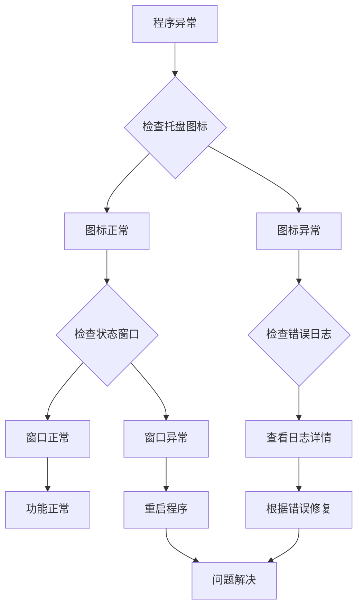

# 软件用途计时计费系统 - 使用说明文档

## 产品概述

软件用途计时计费系统是一款专为门店自助修图设备设计的智能计时收费软件。本系统自动监控"像素蛋糕"修图软件的使用时间，实现精确计时、自动计费、导出拦截和全屏收费弹窗功能。

### 主要功能
- **自动计时**：精确监控像素蛋糕软件使用时间
- **智能计费**：按分钟计费，不满1分钟按1分钟计算
- **导出拦截**：检测到导出操作时自动弹出收费窗口
- **全屏收费**：大字体清晰显示费用信息，适合门店使用
- **管理后台**：密码保护的管理面板，可配置费率、进程名等参数
- **系统托盘**：后台运行，不干扰用户操作

### 适用场景
- 照相馆、影楼自助修图设备
- 图文广告店电脑计时收费
- 网吧、网咖按使用时间收费
- 任何需要按软件使用时间计费的场景

## 快速开始

### 1. 安装部署

#### 方法一：使用打包版（推荐）
1. 下载 `SoftwareUsageMeter.exe` 文件
2. 双击运行即可，无需安装其他软件
3. 程序会自动创建配置文件

#### 方法二：使用Python源码版
1. 确保已安装 Python 3.8+
2. 安装依赖：`pip install -r requirements.txt`
3. 运行程序：`python main.py`

### 2. 首次运行配置

1. **启动程序**：
   - 双击 `SoftwareUsageMeter.exe` 或运行 `python main.py`
   - 程序启动后会在系统托盘显示图标

2. **打开管理面板**：
   - 右键点击托盘图标
   - 选择"打开管理面板"
   - 输入默认密码：`admin`

3. **基本配置**：
   - **费率设置**：设置每分钟收费金额（默认1.0元）
   - **进程名**：保持 "PixCake.exe"（像素蛋糕进程名）
   - **导出关键词**：添加导出窗口识别关键词（默认：导出,Export）
   - **收款码**：上传微信/支付宝收款码图片

4. **保存配置**：
   - 点击"保存配置"按钮
   - 状态栏显示"配置已保存"表示成功

## 详细使用指南

### 1. 系统托盘操作

程序启动后，会在Windows系统托盘显示图标：

#### 图标状态说明
- **绿色图标**：监控中，像素蛋糕正在运行
- **灰色图标**：监控暂停，像素蛋糕未运行
- **闪烁图标**：检测到导出操作，等待支付

#### 右键菜单功能
- **显示状态**：打开状态窗口查看使用详情
- **打开管理面板**：进入配置管理界面
- **暂停计时**：临时暂停计时功能
- **重置计时**：清零当前计时
- **退出**：关闭程序

#### 双击操作
- 双击托盘图标：快速打开状态窗口

### 2. 状态窗口

状态窗口显示当前使用情况：

#### 显示信息
- **使用时长**：当前会话已使用时间
- **应付金额**：根据时长和费率计算的费用
- **计时状态**：运行中/已暂停

#### 窗口操作
- **最小化**：隐藏到任务栏
- **关闭**：隐藏窗口（程序继续运行）
- **置顶显示**：窗口始终显示在最前

### 3. 收费弹窗

当用户在像素蛋糕中点击"导出"时，系统会自动弹出全屏收费窗口：

#### 弹窗特点
- **全屏显示**：覆盖整个屏幕，无法绕过
- **大字体清晰**：适合门店客户查看
- **信息完整**：显示时长、单价、金额、收款码
- **操作简单**：支付后点击"已支付"按钮即可

#### 支付流程
1. 用户在像素蛋糕中点击"导出"
2. 系统弹出收费弹窗
3. 客户扫描收款码支付
4. 点击"已支付"按钮
5. 弹窗关闭，导出操作继续

### 4. 管理面板

管理面板提供完整的配置管理功能：

#### 登录管理
- **默认密码**：`admin`
- **密码修改**：在管理面板中可修改密码
- **密码保护**：配置修改需要密码验证

#### 配置项说明

| 配置项 | 说明 | 默认值 | 建议值 |
|--------|------|--------|--------|
| 费率 | 每分钟收费金额 | 1.0元 | 根据门店定价调整 |
| 进程名 | 监控的软件进程名 | PixCake.exe | 保持默认 |
| 导出关键词 | 识别导出窗口的关键词 | 导出,Export | 可添加更多关键词 |
| 监控间隔 | 进程检查频率 | 2000ms | 1000-3000ms |
| 收款码路径 | 收款码图片路径 | 空 | 上传清晰的收款码 |

#### 配置验证
- **费率验证**：必须大于0的数字
- **进程名验证**：不能为空
- **关键词验证**：用逗号分隔多个关键词

### 5. 计时规则

#### 计费方式
- **按分钟计费**：不满1分钟按1分钟计算
- **实时计算**：费用随使用时间实时更新
- **自动暂停**：软件关闭时自动暂停计时

#### 示例计算
- 使用30秒 → 计费1分钟
- 使用1分30秒 → 计费2分钟
- 使用10分钟 → 计费10分钟

#### 费用公式
```
应付金额 = 使用分钟数 × 费率
```

## 高级功能

### 1. 多用户支持
- **自动重置**：每次支付后自动重置计时
- **独立计费**：每个用户独立计算费用
- **快速切换**：支持用户快速切换

### 2. 异常处理
- **进程异常**：软件崩溃时自动暂停计时
- **网络异常**：离线状态下正常计时
- **系统异常**：程序异常时自动恢复

### 3. 数据持久化
- **自动保存**：配置修改自动保存
- **状态恢复**：程序重启后恢复上次状态
- **备份机制**：配置文件自动备份

### 4. 性能优化
- **低资源占用**：内存<50MB，CPU<5%
- **快速响应**：操作响应时间<100ms
- **稳定运行**：支持长时间连续运行

## 常见问题解答

### Q1: 程序无法启动怎么办？
**A:** 检查以下事项：
1. 确保Windows系统为10或11版本
2. 以管理员身份运行程序
3. 检查杀毒软件是否拦截
4. 重新下载程序文件

### Q2: 无法检测到像素蛋糕怎么办？
**A:** 尝试以下解决方案：
1. 确认像素蛋糕进程名为"PixCake.exe"
2. 以管理员身份运行像素蛋糕
3. 在管理面板中添加更多导出关键词
4. 重启程序后重试

### Q3: 收费弹窗不显示怎么办？
**A:** 检查以下配置：
1. 导出关键词是否匹配像素蛋糕窗口标题
2. 收款码路径是否正确
3. 显示设置是否支持全屏应用
4. 尝试重启程序

### Q4: 计时不准确怎么办？
**A:** 进行以下调整：
1. 同步系统时间
2. 调整监控间隔（建议2000ms）
3. 关闭不必要的后台程序
4. 更新程序到最新版本

### Q5: 如何修改管理员密码？
**A:** 操作步骤：
1. 打开管理面板（密码：admin）
2. 在密码输入框输入新密码
3. 点击"修改密码"按钮
4. 记住新密码，旧密码将失效

### Q6: 程序占用资源太多怎么办？
**A:** 优化建议：
1. 关闭不必要的功能模块
2. 调整监控间隔到3000ms
3. 确保系统有足够内存
4. 定期重启程序

## 故障排除

### 问题诊断流程



### 错误代码说明

| 错误代码 | 含义 | 解决方案 |
|----------|------|----------|
| ERR-001 | 配置文件损坏 | 删除config.json后重启 |
| ERR-002 | 进程监控失败 | 以管理员身份运行 |
| ERR-003 | 窗口识别失败 | 添加更多关键词 |
| ERR-004 | 资源加载失败 | 检查文件路径权限 |
| ERR-005 | 网络连接失败 | 检查网络设置 |

### 日志查看
程序运行日志保存在：
```
%APPDATA%\SoftwareUsageMeter\logs\
```

日志文件命名规则：
```
software_usage_YYYY-MM-DD.log
```

## 维护指南

### 日常维护
1. **定期检查**：
   - 每周检查程序运行状态
   - 每月备份配置文件
   - 每季度更新收款码

2. **性能监控**：
   - 监控内存和CPU使用情况
   - 检查日志文件大小
   - 验证计时准确性

3. **数据备份**：
   - 定期备份配置文件
   - 导出使用记录
   - 保存错误日志

### 版本更新
1. **备份数据**：备份当前配置和使用记录
2. **停止程序**：关闭正在运行的程序
3. **安装新版本**：替换程序文件
4. **恢复配置**：恢复备份的配置文件
5. **测试验证**：验证所有功能正常

### 安全建议
1. **密码安全**：
   - 定期修改管理员密码
   - 使用强密码（字母+数字+符号）
   - 不要共享密码

2. **文件安全**：
   - 保护配置文件权限
   - 定期检查文件完整性
   - 备份重要数据

3. **系统安全**：
   - 保持系统更新
   - 安装防病毒软件
   - 定期安全检查

## 技术支持

### 获取帮助
1. **在线文档**：查看本文档获取详细说明
2. **问题反馈**：记录问题现象和重现步骤
3. **技术支持**：联系开发团队获取帮助

### 联系方式
- **技术支持邮箱**：support@example.com
- **问题反馈表单**：https://example.com/feedback
- **紧急联系电话**：400-xxx-xxxx

### 服务承诺
- **响应时间**：24小时内回复
- **问题解决**：3个工作日内提供解决方案
- **版本更新**：定期发布功能更新和安全补丁

## 附录

### A. 系统要求
- **操作系统**：Windows 10/11 64位
- **内存**：最低2GB，推荐4GB
- **磁盘空间**：最低50MB可用空间
- **显示**：支持1024×768分辨率

### B. 文件结构
```
SoftwareUsageMeter/
├── SoftwareUsageMeter.exe      # 主程序
├── config.json                 # 配置文件
├── resources/                  # 资源文件
│   ├── default_qr.png          # 默认收款码
│   └── icon.ico                # 程序图标
├── logs/                       # 日志目录
└── backup/                     # 备份目录
```

### C. 命令行参数
程序支持以下命令行参数：
```bash
# 静默启动（不显示窗口）
SoftwareUsageMeter.exe --silent

# 指定配置文件路径
SoftwareUsageMeter.exe --config "C:\path\to\config.json"

# 重置为默认配置
SoftwareUsageMeter.exe --reset

# 显示版本信息
SoftwareUsageMeter.exe --version

# 显示帮助信息
SoftwareUsageMeter.exe --help
```

### D. 快捷键列表
| 快捷键 | 功能 | 说明 |
|--------|------|------|
| Ctrl+Shift+S | 显示状态窗口 | 快速查看使用状态 |
| Ctrl+Shift+P | 暂停/恢复计时 | 手动控制计时 |
| Ctrl+Shift+R | 重置计时 | 清零当前计时 |
| Ctrl+Shift+Q | 退出程序 | 安全退出 |
| Ctrl+Shift+M | 管理面板 | 打开配置界面 |

### E. 更新历史
| 版本 | 日期 | 更新内容 |
|------|------|----------|
| v1.0 | 2024-01-01 | 初始版本发布 |
| v1.1 | 2024-02-01 | 优化性能，修复已知问题 |
| v1.2 | 2024-03-01 | 增加多语言支持 |

---

**重要提示**：使用本软件前请仔细阅读本文档。如有任何疑问或问题，请及时联系技术支持团队。

**版权声明**：本软件仅供合法用途使用，禁止用于任何非法活动。使用本软件即表示您同意遵守相关法律法规和软件许可协议。