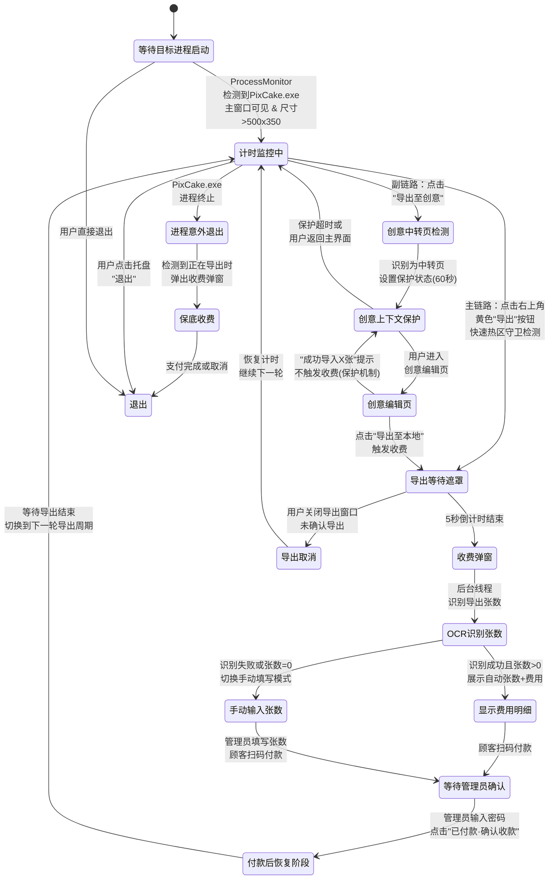
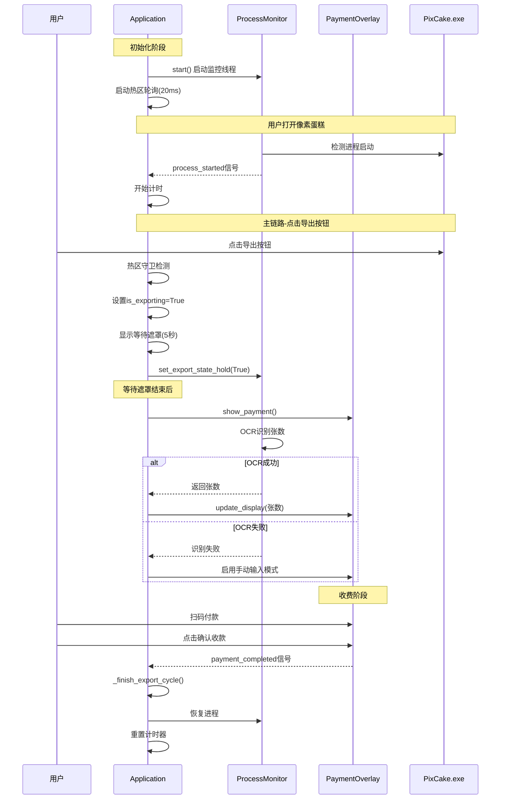
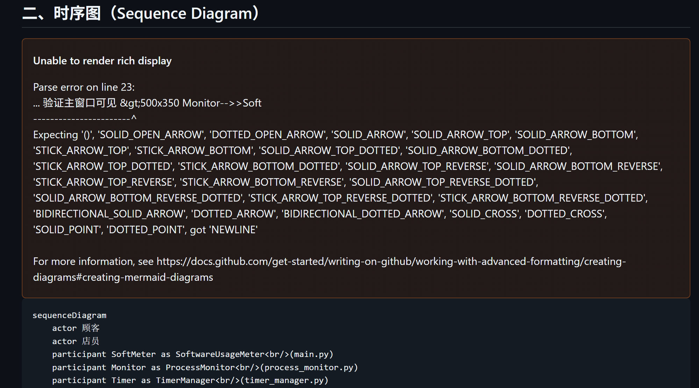

# SoftwareUsageMeter 架构图解与元知识分析

> 生成时间：2026-04-26  
> 更新时间：2026-04-26（副链路保护、主链路优化、手动输入模式）  
> 目的：帮助大学生开发者理解项目架构，从图中提炼可复用的设计经验

---

## 一、状态图（State Diagram）



### 元知识分析

**1. 状态机是复杂桌面应用的灵魂**

状态图暴露了项目最关键的架构决策——**用明确的状态来约束行为，而不是用嵌套的 if-else**。你写的 `_finish_export_cycle()` 之所以能正确地把系统送回 `计时监控中`，正是因为状态定义了"付款完成后下一步是什么"的边界。

核心原则：
- 每个状态对应一组**允许的输入事件**，其余输入应被忽略或报错。
- 状态之间的跃迁应有**单一触发条件**（如 `export_detected` 信号），这样排查问题时只需看"谁发射了这个信号"。

**2. 创意上下文保护状态（新增）**

`创意上下文保护` 是一个关键的防御状态，解决了副链路的误触发问题：
- 用户点击"导出至创意"后，系统进入保护状态（60秒超时）
- 在此状态下，即使检测到黄色按钮或窗口变化，也不会触发收费
- 只有用户明确点击"导出至本地"按钮后，才退出保护状态，触发收费
- 这避免了创意编辑页弹出"成功导入X张图片"提示时误触发收费

**3. 多证据并行检测 = 容错状态机**

你的 6 条检测路径本质上是一个"或门"——任何一条路径命中都进入 `导出等待遮罩` 状态。这对应分布式系统中的 **Eventual Detection（最终检测）** 模式：
- 个别检测路径可能失败（截图模糊、窗口标题被改），但多条路径降低漏检概率
- 代价是可能重复触发，因此你需要防抖机制来过滤重复事件

**4. 防御性状态 = 安全兜底**

`进程意外退出 → 保底收费` 这条路径体现了 **Defensive Programming（防御式编程）**：即使正常流程被中断（进程崩溃），用户的使用仍然会被计费。这种"非正常退出也能回到安全状态"的设计，是商业软件的底线。

**5. 手动输入模式（增强）**

OCR识别失败或识别到0张时，系统会自动切换到手动输入模式：
- 收费框显示"识别失败，请手动输入导出张数"输入框
- 确认按钮在张数>0前保持禁用
- 这避免了OCR识别不准确导致的漏收或少收

---

## 二、时序图（Sequence Diagram）



### 元知识分析

**1. 信号驱动架构 = 松耦合通信**

项目使用 PyQt5 信号/槽机制作为模块间通信的唯一方式。这对应 **Observer Pattern（观察者模式）**：
- `ProcessMonitor` 不直接调用 `Application` 的方法，它只是发射信号
- `Application` 不直接操作 `PaymentOverlay` 的内部状态，只调用其公开方法
- 好处：任何一个模块可单独替换而不影响其他模块

**2. 线程隔离策略**

注意时序图中 `ProcessMonitor` 是一个独立的 `QThread`，但它只负责 CPU 密集型/阻塞工作（截图、OCR、窗口扫描），所有 UI 更新通过信号抛回主线程。这是 PyQt 多线程开发的黄金法则：

> **永远不要在工作线程中直接操作 UI 组件**

**3. 创意上下文保护机制（新增）**

副链路的保护机制通过状态标志实现：
- `_creative_transfer_context_active = True`：标识当前处于创意流程
- `_creative_transfer_ignore_worker_until = now + 60.0`：60秒超时保护
- 当检测到导出信号时，先检查这些标志，如果为真则跳过收费

**4. 热区检测优化（新增）**

主链路的热区检测进行了优化：
- 热区范围放宽：窗口宽度的35%（原24%）、高度的18%（原10%）
- 颜色检测放宽：红≥140、绿≥100、蓝≤120、红≥绿-30
- 这确保不同分辨率和窗口大小下都能正确检测到导出按钮

**5. 等待遮罩防重复触发（新增）**

快速热区守卫触发等待遮罩时，会同时：
- 设置 `_is_exporting = True`
- 设置 `_monitor.set_export_state_hold(True)`
- 传递 `minutes` 和 `rate` 参数

这样监控线程检测到导出信号时，会因为 `is_exporting` 为真而跳过，避免重复弹出等待遮罩。

---

## 三、架构图（Architecture Diagram）



### 架构说明

**核心模块职责**：

| 模块 | 文件 | 职责 |
|------|------|------|
| Application | main.py | 应用入口，状态管理，信号连接 |
| ProcessMonitor | process_monitor.py | 监控线程，进程检测，导出识别 |
| PaymentOverlay | payment_overlay.py | 全屏收费弹窗UI |
| TimerManager | timer_manager.py | 计时管理 |
| ConfigManager | config_manager.py | 配置读写 |
| TrayIconManager | tray_icon.py | 托盘图标和菜单 |

**两条导出链路**：

- **主链路**：点击导出按钮 → 热区检测 → 等待遮罩 → 收费框
- **副链路**：导出至创意 → 中转页保护 → 创意编辑页 → 导出至本地 → 收费框

**防重复触发机制**：

系统使用多个标志位防止重复触发：
- `_is_exporting`：主线程状态标志
- `_hold_export_state`：监控线程保持标志
- `_creative_transfer_context_active`：创意上下文保护标志

---

## 四、流程图（Flowchart）

```mermaid
flowchart TD
    A["🚀 应用启动"] --> B["单实例检测<br/>CreateMutex"]
    B -->|已存在实例| B1["显示 DuplicateInstanceDialog"]
    B1 --> Z["❌ 退出"]
    B -->|唯一实例| C["加载 config.json"]

    C --> D["预热 ExportWaitOverlay"]
    D --> E["启动 20ms 轻量热区轮询<br/>热区范围：35%宽度×18%高度"]
    E --> F["显示启动说明"]
    F -->|用户点击"知道了"| G["启动 ProcessMonitor 线程"]

    G --> H["等待 PixCake.exe 启动"]
    H --> I{"检测到 PixCake<br/>主窗口?"}
    I -->|否| H
    I -->|是| J["计时器开始<br/>图标变绿"]

    J --> K{"检测到导出行为?"}

    K -->|主链路：点击导出按钮| K1["快速热区守卫检测<br/>颜色+位置验证"]
    K1 --> K2["设置 _is_exporting=True<br/>传递参数"]
    K2 --> M["显示导出等待遮罩<br/>5秒倒计时"]

    K -->|副链路：导出至创意| L{"是'导出至创意'中转页?"}
    L -->|是| L1["设置创意上下文保护<br/>60秒超时"]
    L1 --> L2["用户进入创意编辑页"]
    L2 --> L3{"点击'导出至本地'?"}
    L3 -->|是| M
    L3 -->|否：提示或其他操作| L2
    L -->|否| M

    M --> N1{"5秒内取消?"}
    N1 -->|是 取消| N2["恢复进程<br/>恢复计时"]
    N2 --> J
    N1 -->|否 确认| O["显示收费弹窗"]

    O --> P{"OCR识别张数"}
    P -->|成功且张数>0| Q["显示费用明细"]
    P -->|失败或张数=0| U["切换手动输入模式<br/>显示输入框"]
    U --> U1["管理员手动填写张数"]
    U1 --> Q

    Q --> X{"顾客扫码付款<br/>+ 管理员点击确认"}
    X --> Y{"手动输入模式<br/>且张数=0?"}
    Y -->|张数无效| X
    Y -->|有效| AA["密码验证"]

    AA --> AB{"密码验证通过?"}
    AB -->|否| X
    AB -->|是| AC["关闭收费弹窗"]

    AC --> AD["解锁目标窗口"]
    AD --> AE["恢复目标进程"]
    AE --> AF["计时器清零并重启"]
    AF --> AG["启动尾迹保护"]
    AG --> J

    K -->|进程退出| AH{"正在导出中?"}
    AH -->|是| AI["保底收费弹窗"]
    AI --> AJ["等待支付或取消"]
    AJ --> AK{"支付完成?"}
    AK -->|是| AL["记录费用"]
    AK -->|否 取消| AL
    AL --> Z
    AH -->|否| Z

    K -->|用户手动退出| Z
```

### 元知识分析

**1. 主副链路分离设计**

流程图清晰地展示了主链路和副链路的分离：
- **主链路**：点击导出按钮 → 热区检测 → 等待遮罩 → 收费
- **副链路**：导出至创意 → 中转页保护 → 创意编辑页 → 导出至本地 → 收费

这种分离确保了不同入口的用户体验一致性，同时避免了误触发。

**2. 手动输入模式的触发条件（更新）**

手动输入模式在以下情况下触发：
- OCR识别完全失败（返回None）
- OCR识别到张数为0
- OCR识别到负数（理论上不应发生）

这比原来的"识别失败才触发"更加严格，避免了0张导致的漏收。

**3. 热区检测的双重验证**

热区守卫使用双重验证：
1. **位置验证**：光标在热区范围内（窗口右上角35%×18%）
2. **颜色验证**：光标附近有黄色像素（红≥140、绿≥100、蓝≤120）

只有两者都满足，才认为用户点击了导出按钮。

**4. 防重复触发机制**

流程图中的"设置 _is_exporting=True"是一个关键的防护点：
- 快速热区守卫触发后立即设置此标志
- 监控线程检测到导出时会检查此标志
- 如果已设置，则跳过，避免重复弹窗

---

## 五、关键代码片段解析

### 4.1 创意上下文保护

```python
# process_monitor.py
# 当检测到创意中转页时，设置保护状态
if creative_transfer_layout:
    self._creative_transfer_context_active = True
    self._creative_transfer_ignore_worker_until = now + 60.0  # 60秒超时

# 当处于保护状态时，检测到黄色按钮不触发收费
if self._creative_transfer_context_active and export_visual_candidate:
    # 跳过收费，保持在保护状态
    pass
```

### 4.2 热区检测优化

```python
# main.py
# 放宽热区范围，确保覆盖到按钮
hot_width = min(max(int(width * 0.35), 420), 800)  # 原来是 0.24
hot_height = min(max(int(height * 0.18), 100), 200)  # 原来是 0.10

# 放宽颜色检测范围
def _is_export_button_yellow(color: int) -> bool:
    red = color & 0xFF
    green = (color >> 8) & 0xFF
    blue = (color >> 16) & 0xFF
    return red >= 140 and green >= 100 and blue <= 120 and red >= green - 30
```

### 4.3 手动输入模式触发

```python
# main.py
def _on_refine_result(self, count, source: str, minutes: int, rate: float):
    # 识别失败或识别到0张时，启用手动输入模式
    if count is None or count <= 0:
        self._overlay.set_counting_status(False)
        self._overlay.set_manual_export_count_required(True)
        return
```

### 4.4 防重复触发

```python
# main.py
# 快速热区守卫触发时，同时设置状态和参数
self._is_exporting = True
self._payment_confirmed = False
self._monitor.set_export_state_hold(True)
minutes = self._timer.get_elapsed_minutes()
rate = self._config.rate
self._show_export_wait_overlay(minutes, rate)  # 传递参数，不依赖监控线程
```

---

## 六、经验总结

### 架构层面

| 经验 | 说明 |
|------|------|
| **信号驱动 > 直接调用** | 用 PyQt5 信号/槽实现模块间通信，避免循环依赖 |
| **线程隔离** | 工作线程只做 CPU 密集/阻塞操作，UI 更新始终回主线程 |
| **状态机显式化** | 不要用布尔标志的组合来表示系统状态，用明确的枚举/字符串 |
| **纯函数分离** | 费用计算等业务逻辑抽成纯函数，方便独立测试和修改 |
| **主副链路分离** | 不同入口使用不同的状态路径，避免误触发 |

### 稳定性层面

| 经验 | 说明 |
|------|------|
| **上下文保护状态** | 创意编辑页等非计费场景需要保护机制，防止误触发收费 |
| **热区检测容错** | 放宽热区和颜色检测范围，适应不同分辨率和窗口大小 |
| **手动输入兜底** | OCR失败时必须有手动输入选项，避免系统锁死 |
| **防重复触发** | 触发等待遮罩时设置状态标志，防止多路径重复触发 |
| **幂等操作** | 挂起/恢复等副作用操作必须保证幂等，防止崩溃后无法恢复 |
| **预热机制** | 启动时预创建重资源，避免首次使用时卡顿 |

### 工程实践层面

| 经验 | 说明 |
|------|------|
| **JSON 配置文件** | 小项目不需要数据库，JSON 足够且易于手动排错 |
| **编译时排查** | `_write_early_crash_log()` 在 PyQt5 加载前就记录异常 |
| **Safe Default** | ConfigManager 的 `load()` 在文件不存在时返回默认值 |
| **SHA-256 密码** | 配置文件中的密码是哈希值而非明文 |
| **超时设计** | 创意上下文保护60秒超时，足够用户完成操作 |

### 商业产品思维

| 思维 | 体现 |
|------|------|
| **延迟收费** | 在导出前拦截，而非预付费——降低顾客决策门槛 |
| **双码支付** | 微信+支付宝覆盖绝大多数用户，减少支付障碍 |
| **副链路保护** | 创意编辑页不误触发收费，提升用户体验 |
| **手动输入兜底** | OCR失败时管理员可手动填写，避免漏收 |
| **日志可追溯** | 分层日志便于远程定位问题，无需现场介入 |

---

## 七、可以进一步学习的知识点

1. **状态机设计**：阅读"State Pattern"相关资料，对比本项目状态机的优劣
2. **PyQt5 信号/槽**：理解 Qt 的事件循环和多线程模型
3. **Windows API 编程**：`FindWindow`、`PrintWindow`、`SuspendThread` 等底层 API 的使用
4. **OCR 集成**：Windows OCR 引擎（UWP OCR）的调用方式和精度限制
5. **防抖/节流模式**：前端的 Debounce/Throttle 思想在桌面应用中的移植
6. **桌面应用打包**：PyInstaller 的 spec 文件配置和依赖裁剪策略
7. **防御式编程**：如何保证程序在各种异常情况下仍然能恢复到安全状态
8. **上下文状态管理**：如何设计状态标志来区分不同业务流程
